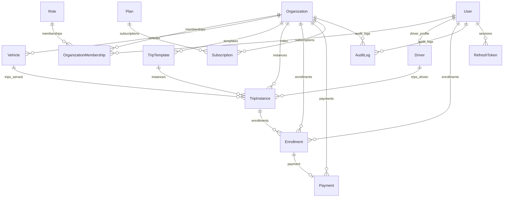

# Modelo de Dados — Movy API

> Referência do schema PostgreSQL. Gerado via Prisma. Schema fonte: `prisma/schema.prisma`.

---

## 1. Diagrama de Entidades



---

## 2. Tabelas

### `organization`

Entidade raiz do multi-tenant. Todos os recursos de negócio pertencem a uma organização.

| Campo | Tipo | Descrição |
|---|---|---|
| `id` | UUID PK | Identificador único |
| `name` | VarChar(255) | Nome da empresa |
| `cnpj` | String UNIQUE | CNPJ (validado com dígitos verificadores) |
| `email` | String UNIQUE | E-mail corporativo |
| `telephone` | VarChar(20) | Telefone |
| `address` | VarChar(255) | Endereço completo |
| `slug` | VarChar(100) UNIQUE | Identificador URL-friendly (gerado automaticamente) |
| `status` | `ACTIVE \| INACTIVE` | Soft delete via status |
| `createdAt` | DateTime | — |
| `updatedAt` | DateTime | Atualizado automaticamente |

**Índices:** `slug`, `status`

**Cascade:** deletar org cascadeia para memberships, vehicles, templates, instances, enrollments, payments, subscriptions, auditLogs.

---

### `user`

Representa um usuário do sistema — pode ser admin, motorista ou passageiro (B2C).

| Campo | Tipo | Descrição |
|---|---|---|
| `id` | UUID PK | — |
| `name` | VarChar(255) | Nome completo |
| `email` | VarChar(255) UNIQUE | E-mail (usado para login) |
| `passwordHash` | String | bcrypt hash (10 rounds) — nunca exposto na API |
| `telephone` | VarChar(20) | — |
| `status` | `ACTIVE \| INACTIVE` | Soft delete |
| `createdAt` | DateTime | — |
| `updatedAt` | DateTime | — |

**Índices:** `status`

**Relações:**
- `driver` → perfil de motorista (opcional, 1:1)
- `userRoles` → memberships em organizações
- `enrollments` → inscrições em viagens
- `refreshTokens` → sessões ativas

---

### `refresh_tokens`

Armazena JTIs de refresh tokens para permitir revogação de sessões.

| Campo | Tipo | Descrição |
|---|---|---|
| `jti` | String PK | UUID do claim `jti` do refresh token |
| `userId` | String FK | Usuário dono da sessão |
| `expiresAt` | DateTime | Expiração (espelho do JWT `exp`) |
| `createdAt` | DateTime | — |

**Cascade:** deletar usuário remove todos seus tokens (`onDelete: Cascade`).

---

### `role`

Tabela de roles do sistema. Populada via seed (`npm run db:seed`).

| Campo | Tipo | Descrição |
|---|---|---|
| `id` | Int PK (auto-increment) | — |
| `name` | `ADMIN \| DRIVER` UNIQUE | Nome da role |
| `createdAt` | DateTime | — |
| `updatedAt` | DateTime | — |

**Nota:** Não há role `USER` na tabela — usuário B2C não tem role no sistema, apenas um `User` sem memberships.

---

### `user_role` (OrganizationMembership)

Tabela pivot que associa um usuário a uma organização com uma role. Chave primária composta.

| Campo | Tipo | Descrição |
|---|---|---|
| `userId` | String FK | Referencia `user.id` |
| `roleId` | Int FK | Referencia `role.id` |
| `organizationId` | String FK | Referencia `organization.id` |
| `assignedAt` | DateTime | Data de criação da membership |
| `removedAt` | DateTime? | Soft delete: nulo = ativa, preenchida = removida |

**PK:** `(userId, roleId, organizationId)` — impede duplicatas exatas. Um usuário pode ter `ADMIN` e `DRIVER` na mesma org (roles diferentes).

**Cascade:** todas as FKs com `onDelete: Cascade`.

---

### `driver`

Perfil de motorista. Entidade global — **sem `organizationId`**. O vínculo driver→org é feito via `user_role`.

| Campo | Tipo | Descrição |
|---|---|---|
| `id` | UUID PK | — |
| `userId` | String UNIQUE FK | 1:1 com usuário — um user só pode ter um perfil driver |
| `cnh` | VarChar(20) UNIQUE | Número da CNH (9-12 chars alfanuméricos) |
| `cnhCategory` | VarChar(5) | Categoria (A, B, C, D, E) |
| `cnhExpiresAt` | DateTime | Data de validade da CNH |
| `driverStatus` | `ACTIVE \| INACTIVE \| SUSPENDED` | Status do motorista |
| `createdAt` | DateTime | — |
| `updatedAt` | DateTime | — |

**Por que sem `organizationId`?** Um motorista pode trabalhar em múltiplas organizações simultaneamente. O vínculo é feito via membership com `role=DRIVER`.

---

### `vehicle`

Veículo pertencente a uma organização. FK direta para `organization`.

| Campo | Tipo | Descrição |
|---|---|---|
| `id` | UUID PK | — |
| `plate` | VarChar(10) UNIQUE | Placa (única no sistema) |
| `model` | VarChar(255) | Modelo do veículo |
| `type` | `VAN \| BUS \| MINIBUS \| CAR` | Tipo |
| `maxCapacity` | Int | Capacidade máxima de passageiros |
| `status` | `ACTIVE \| INACTIVE` | Soft delete |
| `organizationId` | String FK | Tenant owner |
| `createdAt` | DateTime | — |
| `updatedAt` | DateTime | — |

**Índices:** `organizationId`, `status`

**Cascade:** deletar org cascadeia para veículos. Mas `TripInstance.vehicleId` usa `onDelete: Restrict` — não é possível deletar um veículo que tenha instâncias de viagem associadas.

---

### `plan`

Planos disponíveis no SaaS. Populados via seed.

| Campo | Tipo | Descrição |
|---|---|---|
| `id` | Int PK (auto-increment) | — |
| `name` | `FREE \| BASIC \| PRO \| PREMIUM` UNIQUE | — |
| `price` | Decimal(10,2) | Preço mensal |
| `maxVehicles` | Int | Limite de veículos |
| `maxDrivers` | Int | Limite de motoristas |
| `maxMonthlyTrips` | Int | Limite de instâncias de viagem por mês |
| `durationDays` | Int DEFAULT 30 | Duração da assinatura em dias |
| `isActive` | Boolean | Plano disponível para novas assinaturas |
| `createdAt` | DateTime | — |
| `updatedAt` | DateTime | — |

**Índices:** `isActive`

---

### `subscriptions`

Assinatura de uma organização a um plano.

| Campo | Tipo | Descrição |
|---|---|---|
| `id` | UUID PK | — |
| `organizationId` | String FK | Organização assinante |
| `planId` | Int FK | Plano contratado |
| `status` | `ACTIVE \| CANCELED \| PAST_DUE` | — |
| `activeKey` | String? UNIQUE | Token de idempotência para evitar assinaturas duplicadas simultâneas |
| `startDate` | DateTime | Início da assinatura |
| `expiresAt` | DateTime | Expiração — verificada lazy (on-demand, não por cron) |
| `createdAt` | DateTime | — |
| `updatedAt` | DateTime | — |

**Índices:** `organizationId`, `status`, `expiresAt`

**Lazy expiration:** a assinatura não expira por cron. Quando lida, `resolveActiveSubscription()` verifica se `expiresAt < now()` e a marca como `PAST_DUE` no momento da consulta.

---

### `trip_template`

Template de viagem recorrente. Define rota, frequência, preços e configurações de auto-cancelamento.

| Campo | Tipo | Descrição |
|---|---|---|
| `id` | UUID PK | — |
| `organizationId` | String FK | Tenant owner |
| `departurePoint` | VarChar(255) | Ponto de partida |
| `destination` | VarChar(255) | Destino |
| `frequency` | `DayOfWeek[]` | Dias da semana em que a viagem ocorre |
| `stops` | `String[]` | Paradas intermediárias |
| `priceOneWay` | Decimal(10,2)? | Preço só ida |
| `priceReturn` | Decimal(10,2)? | Preço só volta |
| `priceRoundTrip` | Decimal(10,2)? | Preço ida e volta |
| `isPublic` | Boolean | Se visível para passageiros B2C |
| `isRecurring` | Boolean | Se gera instâncias automaticamente |
| `autoCancelEnabled` | Boolean | Se habilita cancelamento automático por receita mínima |
| `minRevenue` | Decimal(10,2)? | Receita mínima para a viagem não ser cancelada |
| `autoCancelOffset` | Int? | Minutos antes da partida para avaliar cancelamento automático |
| `status` | `ACTIVE \| INACTIVE` | — |
| `shift` | `MORNING \| AFTERNOON \| EVENING` | Turno |
| `createdAt` | DateTime | — |
| `updatedAt` | DateTime | — |

**Índices:** `organizationId`, `status`, `isPublic`

**Regra de preço:** pelo menos um dos três preços deve ser definido (validado no use case).

---

### `trip_instance`

Instância concreta de uma viagem derivada de um template. É o que passageiros se inscrevem.

| Campo | Tipo | Descrição |
|---|---|---|
| `id` | UUID PK | — |
| `tripTemplateId` | String FK | Template de origem |
| `organizationId` | String FK | Tenant (snapshot — mantido mesmo se template mudar) |
| `driverId` | String? FK | Motorista designado (opcional) |
| `vehicleId` | String? FK | Veículo designado (opcional) |
| `tripStatus` | `DRAFT \| SCHEDULED \| CONFIRMED \| IN_PROGRESS \| FINISHED \| CANCELED` | FSM de status |
| `totalCapacity` | Int | Snapshot da capacidade do veículo no momento da criação |
| `isPublic` | Boolean | Snapshot de `TripTemplate.isPublic` |
| `minRevenue` | Decimal(10,2)? | Snapshot do template (null se autoCancelEnabled=false) |
| `autoCancelAt` | DateTime? | `departureTime - autoCancelOffset` (null se não habilitado) |
| `forceConfirm` | Boolean | Se admin forçou confirmação ignorando receita mínima |
| `departureTime` | DateTime | Horário de partida |
| `arrivalEstimate` | DateTime | Horário estimado de chegada |
| `createdAt` | DateTime | — |
| `updatedAt` | DateTime | — |

**Índices:** `organizationId`, `tripStatus`, `isPublic`, `departureTime`, `autoCancelAt`, e compostos por template+org, driver+org, vehicle+org.

**Transições de status:**
```
DRAFT → SCHEDULED → CONFIRMED → IN_PROGRESS → FINISHED
                              ↘
                               CANCELED (qualquer status exceto FINISHED)
```

**FKs de Restrict:** `driverId` e `vehicleId` usam `onDelete: Restrict` — não é possível deletar um driver ou veículo com instâncias de viagem associadas (preserva histórico financeiro).

---

### `enrollment`

Inscrição de um passageiro em uma instância de viagem. Equivale a um "booking".

| Campo | Tipo | Descrição |
|---|---|---|
| `id` | UUID PK | — |
| `userId` | String FK | Passageiro |
| `tripInstanceId` | String FK | Viagem |
| `organizationId` | String FK | Tenant (snapshot) |
| `status` | `ACTIVE \| INACTIVE` | Soft delete |
| `presenceConfirmed` | Boolean | Confirmado pelo motorista/admin |
| `enrollmentType` | `ONE_WAY \| RETURN \| ROUND_TRIP` | Tipo de inscrição |
| `recordedPrice` | Decimal(10,2) | Preço no momento da inscrição (snapshot) |
| `activeKey` | String? UNIQUE | Token de idempotência |
| `boardingStop` | VarChar(255) | Ponto de embarque |
| `alightingStop` | VarChar(255) | Ponto de desembarque |
| `enrollmentDate` | DateTime | Data/hora da inscrição |
| `createdAt` | DateTime | — |
| `updatedAt` | DateTime | — |

**Índices:** `userId`, `tripInstanceId`, `organizationId`, `status`, composto `(userId, tripInstanceId, status)`

---

### `payment`

Pagamento associado a uma inscrição. Criado atomicamente com a enrollment via UnitOfWork.

| Campo | Tipo | Descrição |
|---|---|---|
| `id` | UUID PK | — |
| `organizationId` | String FK | Tenant |
| `enrollmentId` | String UNIQUE FK | 1:1 com enrollment |
| `method` | `MONEY \| PIX \| CREDIT_CARD \| DEBIT_CARD` | Método |
| `amount` | Decimal(10,2) | Valor (snapshot de `recordedPrice`) |
| `status` | `PENDING \| COMPLETED \| FAILED` | Simulado via endpoints |
| `createdAt` | DateTime | — |
| `updatedAt` | DateTime | — |

**Índices:** `organizationId`, `status`

**Simulação:** pagamentos são confirmados/falhados via `PATCH /organizations/:orgId/payments/:id/confirm` (ou `/fail`). Apenas pagamentos `PENDING` podem ser processados.

---

### `audit_log`

Log de auditoria para ações relevantes dentro de uma organização.

| Campo | Tipo | Descrição |
|---|---|---|
| `id` | UUID PK | — |
| `organizationId` | String FK | Tenant |
| `userId` | String FK | Usuário que executou a ação |
| `action` | VarChar(255) | Descrição da ação |
| `details` | Json? | Contexto: `entityType`, `entityId`, `changes`, `ipAddress`, etc. |
| `timestamp` | DateTime | Momento da ação |

**FK de Restrict:** `userId` usa `onDelete: Restrict` — não é possível deletar um usuário com logs de auditoria associados.

---

## 3. Enums

| Enum | Valores |
|---|---|
| `Status` | `ACTIVE`, `INACTIVE` |
| `DriverStatus` | `ACTIVE`, `INACTIVE`, `SUSPENDED` |
| `RoleName` | `ADMIN`, `DRIVER` |
| `TripStatus` | `DRAFT`, `SCHEDULED`, `CONFIRMED`, `IN_PROGRESS`, `FINISHED`, `CANCELED` |
| `EnrollmentType` | `ONE_WAY`, `RETURN`, `ROUND_TRIP` |
| `PaymentStatus` | `PENDING`, `COMPLETED`, `FAILED` |
| `MethodPayment` | `MONEY`, `PIX`, `CREDIT_CARD`, `DEBIT_CARD` |
| `VehicleType` | `VAN`, `BUS`, `MINIBUS`, `CAR` |
| `DayOfWeek` | `SUNDAY` → `SATURDAY` |
| `Shift` | `MORNING`, `AFTERNOON`, `EVENING` |
| `PlanName` | `FREE`, `BASIC`, `PRO`, `PREMIUM` |
| `SubscriptionStatus` | `ACTIVE`, `CANCELED`, `PAST_DUE` |

---

## 4. Políticas de Deleção

| Relação | Política | Motivo |
|---|---|---|
| `Organization → *` | CASCADE | Deletar org limpa todos os dados associados |
| `User → memberships, enrollments, refreshTokens` | CASCADE | Dados do usuário somem com ele |
| `User → auditLogs` | RESTRICT | Preservar histórico de auditoria |
| `Driver → tripInstances` | RESTRICT | Preservar histórico financeiro |
| `Vehicle → tripInstances` | RESTRICT | Preservar histórico financeiro |
| `TripInstance → enrollments` | CASCADE | Sem instância, sem inscrição |
| `Enrollment → payment` | CASCADE | Sem inscrição, sem pagamento |

---

## 5. Soft Delete vs Hard Delete

| Entidade | Estratégia | Campo |
|---|---|---|
| `User` | Soft delete | `status = INACTIVE` |
| `Organization` | Soft delete | `status = INACTIVE` |
| `Driver` | Soft delete | `driverStatus = INACTIVE` ou `SUSPENDED` |
| `Vehicle` | Soft delete | `status = INACTIVE` |
| `TripTemplate` | Soft delete | `status = INACTIVE` |
| `OrganizationMembership` | Soft delete | `removedAt = timestamp` |
| `Enrollment` | Soft delete | `status = INACTIVE` |
| `TripInstance` | Mudança de status | `tripStatus = CANCELED` |
