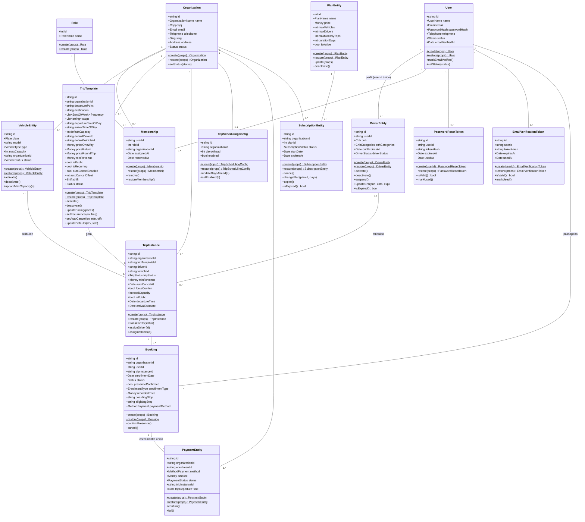

# Diagrama de Classes — Modelo de Domínio (Movy API)

Modelo de domínio extraído das **entidades de domínio** (`src/modules/<módulo>/domain/entities/`)
e dos **Value Objects** compartilhados/por módulo. Reflete o estado do código em **04 Jun 2026**.

> **Convenções.** As classes representam as *entidades de domínio* (não as tabelas Prisma nem os
> DTOs). Atributos tipados por Value Objects (`Email`, `Money`, `Cnh`, …) indicam composição —
> detalhada na §3. Métodos estáticos `create()`/`restore()` seguem o padrão Factory/DDD em todas as
> entidades (`create` valida invariantes; `restore` reidrata da persistência sem validar). Por
> concisão, apenas os métodos de comportamento mais relevantes são listados.

---

## 1. Entidades de domínio e relacionamentos

---

## 2. Value Objects e composição

Value Objects são imutáveis: `create()` valida e lança em entrada inválida; `restore()` reidrata sem
validar. Todos expõem o valor encapsulado via getter `value_` (exceto `CnhCategories`, que expõe
`values` — uma coleção ordenada e deduplicada).

```mermaid
classDiagram
    direction LR

    class Email {
        -string value
        +create(v)$ Email
        +restore(v)$ Email
        +value_ string
    }
    class Telephone {
        -string value
        +create(v)$ Telephone
        +value_ string
    }
    class Money {
        -number value
        +create(v)$ Money
        +restore(v)$ Money
        +value_ number
        +add(o) Money
        +subtract(o) Money
        +equals(o) bool
    }
    class UserName {
        +create(v)$ UserName
        +value_ string
    }
    class PasswordHash {
        +create(v)$ PasswordHash
        +value_ string
    }
    class Cnpj {
        +create(v)$ Cnpj
        +value_ string
    }
    class Slug {
        +create(v)$ Slug
        +value_ string
    }
    class OrganizationName {
        +create(v)$ OrganizationName
        +value_ string
    }
    class Address {
        +create(v)$ Address
        +value_ string
    }
    class Cnh {
        +create(v)$ Cnh
        +value_ string
    }
    class CnhCategories {
        -CnhCategoryType[] values
        +create(vals)$ CnhCategories
        +restore(vals)$ CnhCategories
        +values List~CnhCategoryType~
        +has(c) bool
        +equals(o) bool
    }
    class Plate {
        +create(v)$ Plate
        +value_ string
    }

    User *-- UserName
    User *-- PasswordHash
    User *-- Email
    User *-- Telephone

    Organization *-- OrganizationName
    Organization *-- Cnpj
    Organization *-- Slug
    Organization *-- Address
    Organization *-- Email
    Organization *-- Telephone

    DriverEntity *-- Cnh
    DriverEntity *-- CnhCategories
    VehicleEntity *-- Plate

    TripTemplate *-- Money
    TripInstance *-- Money
    Booking *-- Money
    PaymentEntity *-- Money
    PlanEntity *-- Money
```

> `Email`, `Telephone` e `Money` são Value Objects **compartilhados** (`src/shared/domain/.../value-objects/`),
> reutilizados por várias entidades. Os demais são específicos do módulo de origem.

---

## 3. Enumerações

```mermaid
classDiagram
    direction LR

    class Status {
        <<enumeration>>
        ACTIVE
        INACTIVE
    }
    class RoleName {
        <<enumeration>>
        ADMIN
        DRIVER
    }
    class DriverStatus {
        <<enumeration>>
        ACTIVE
        INACTIVE
        SUSPENDED
    }
    class VehicleStatus {
        <<enumeration>>
        ACTIVE
        INACTIVE
    }
    class VehicleType {
        <<enumeration>>
        VAN
        BUS
        MINIBUS
        CAR
    }
    class TripStatus {
        <<enumeration>>
        DRAFT
        SCHEDULED
        CONFIRMED
        IN_PROGRESS
        FINISHED
        CANCELED
    }
    class DayOfWeek {
        <<enumeration>>
        SUNDAY
        MONDAY
        TUESDAY
        WEDNESDAY
        THURSDAY
        FRIDAY
        SATURDAY
    }
    class Shift {
        <<enumeration>>
        MORNING
        AFTERNOON
        EVENING
    }
    class EnrollmentType {
        <<enumeration>>
        ONE_WAY
        RETURN
        ROUND_TRIP
    }
    class MethodPayment {
        <<enumeration>>
        MONEY
        PIX
        CREDIT_CARD
        DEBIT_CARD
    }
    class PaymentStatus {
        <<enumeration>>
        PENDING
        COMPLETED
        FAILED
    }
    class SubscriptionStatus {
        <<enumeration>>
        ACTIVE
        CANCELED
        PAST_DUE
    }
    class PlanName {
        <<enumeration>>
        FREE
        BASIC
        PRO
        PREMIUM
    }
```

---

## 4. Tabela de relacionamentos

| Origem | Destino | Multiplicidade | Natureza / restrição |
|---|---|---|---|
| User | DriverEntity | 1 — 0..1 | `Driver.userId` **único**: um usuário tem no máximo um perfil de motorista (global, multi-org via Membership) |
| User | Membership | 1 — 0..* | Associação do usuário a organizações/roles |
| Organization | Membership | 1 — 0..* | Memberships da organização (soft delete via `removedAt`) |
| Role | Membership | 1 — 0..* | Chave composta `(userId, roleId, organizationId)` |
| User | PasswordResetToken | 1 — 0..* | Tokens one-shot (TTL 1h), apenas hash persistido |
| User | EmailVerificationToken | 1 — 0..* | Tokens one-shot (TTL 24h), apenas hash persistido |
| Organization | VehicleEntity | 1 — 0..* | Frota da organização (tenant scope) |
| Organization | TripTemplate | 1 — 0..* | Modelos de rota da organização |
| Organization | TripInstance | 1 — 0..* | Execuções de viagem da organização |
| Organization | TripSchedulingConfig | 1 — 0..1 | Config de geração/auto-cancel (`organizationId` único) |
| TripTemplate | TripInstance | 1 — 0..* | Template gera instâncias (snapshot de capacidade/preço) |
| DriverEntity | TripInstance | 0..1 — 0..* | Atribuição opcional (`driverId` nulo até agendar) |
| VehicleEntity | TripInstance | 0..1 — 0..* | Atribuição opcional (`vehicleId` nulo até agendar) |
| TripInstance | Booking | 1 — 0..* | Inscrições (tabela `enrollment`) |
| User | Booking | 1 — 0..* | Passageiro da reserva |
| Booking | PaymentEntity | 1 — 0..1 | `Payment.enrollmentId` **único**: um pagamento por inscrição |
| Organization | PaymentEntity | 1 — 0..* | Pagamentos da organização (tenant scope) |
| Organization | SubscriptionEntity | 1 — 0..* | Histórico de assinaturas (uma ACTIVE por vez) |
| PlanEntity | SubscriptionEntity | 1 — 0..* | Plano assinado; limites aplicados via `PlanLimitService` |

> **Notas para o artigo.**
> - `Membership` é a tabela-pivô que materializa o N:N entre `User` e `Organization`, carregando o `Role` —
>   é a fonte de verdade do RBAC (motorista pode pertencer a várias organizações com o mesmo `driverId`).
> - `TripTemplate` → `TripInstance` é o padrão **template → instância** que viabiliza viagens recorrentes.
> - `Booking` mapeia para a tabela `enrollment`; o invariante "no máximo 1 inscrição ATIVA por
>   `(userId, tripInstanceId)`" é garantido por chave única em `activeKey` no banco.
> - `tripInstanceId`/`tripDepartureTime` em `PaymentEntity` são *snapshots* de leitura (não persistidos),
>   derivados via `enrollment → tripInstance`.
