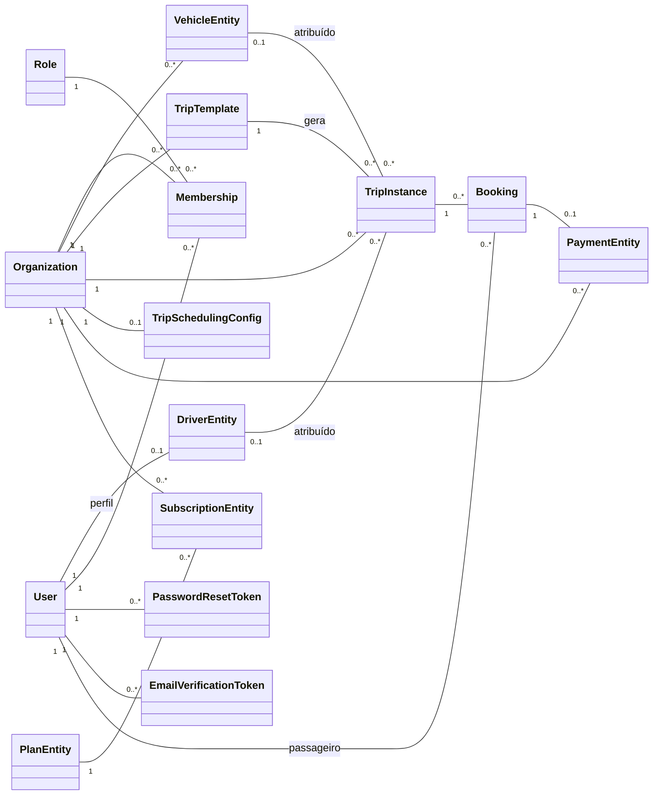
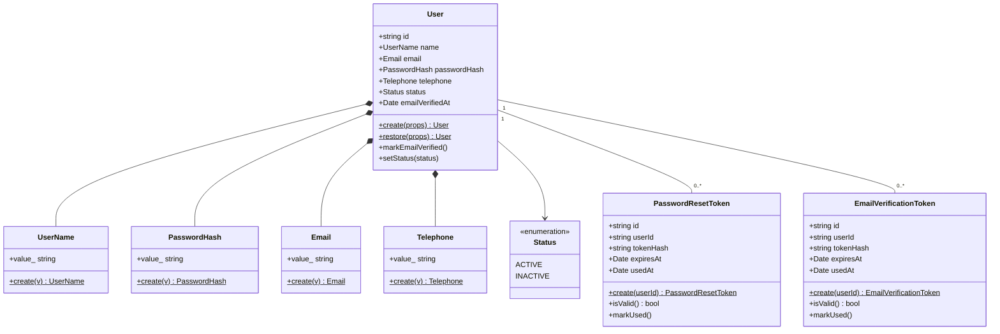
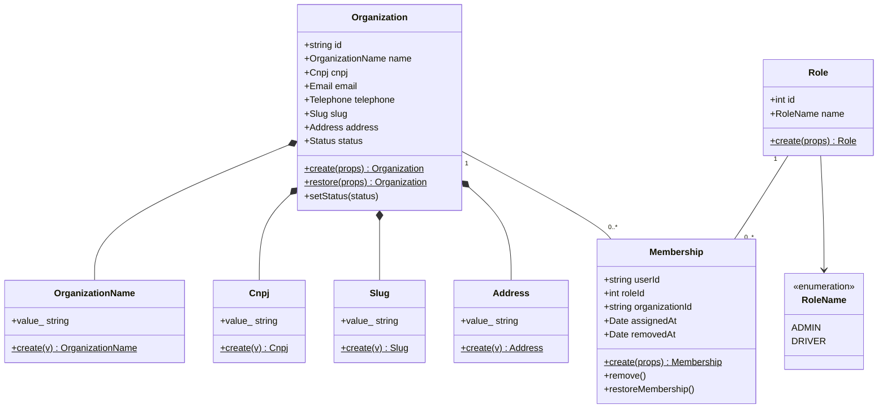
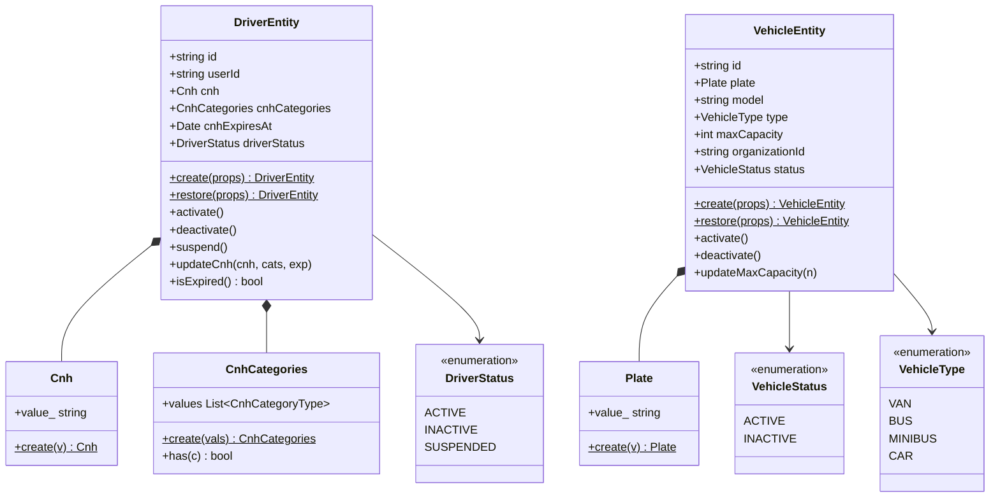
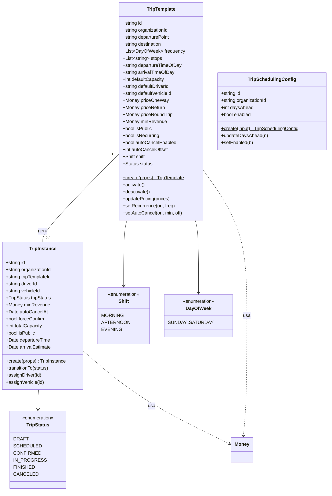
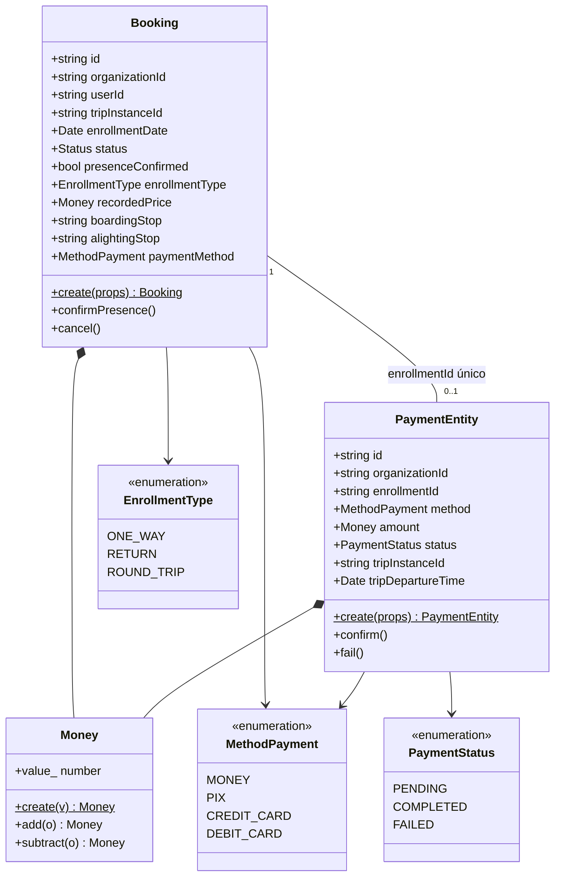
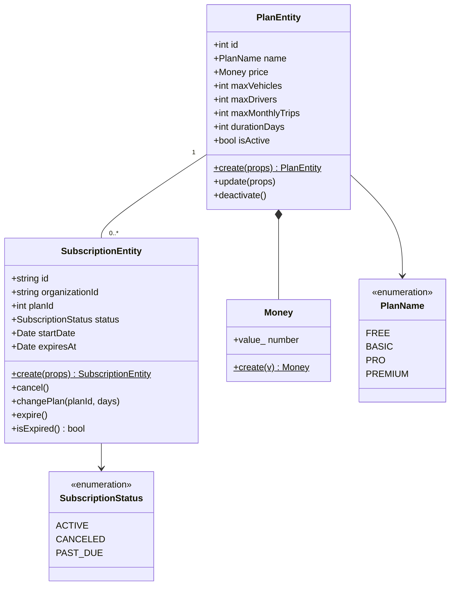

# Diagrama de Classes — Modelo de Domínio (Movy API)

Modelo de domínio extraído das **entidades de domínio** (`src/modules/<módulo>/domain/entities/`)
e dos **Value Objects**. Reflete o estado do código em **04 Jun 2026**.

Para legibilidade em documento impresso/LaTeX, o modelo é apresentado em **um mapa panorâmico**
(Fig. 1, só entidades e relações) seguido de **figuras de detalhe por contexto delimitado**
(Figs. 2–7, com atributos, métodos e Value Objects). O **DER relacional** (tabelas/colunas) é
gerado à parte pelo Prisma e não é duplicado aqui.

> **Convenções.** Métodos estáticos `create()`/`restore()` seguem o padrão Factory/DDD: `create`
> valida invariantes; `restore` reidrata da persistência sem validar. Value Objects são imutáveis
> e expõem o valor via getter `value_` (exceto `CnhCategories`, que expõe `values`). `$` marca
> método estático. Por concisão, listam-se apenas os métodos de comportamento mais relevantes.

---

## Fig. 1 — Mapa geral de entidades

Visão panorâmica: caixas sem atributos, apenas as associações e multiplicidades. Os detalhes de
cada grupo estão nas figuras seguintes.



---

## Fig. 2 — Contexto: Usuário & Autenticação



> Tokens de reset de senha (TTL 1h) e verificação de e-mail (TTL 24h) compartilham o mesmo modelo:
> apenas o **hash SHA-256** é persistido; o token bruto (`rawToken`) só existe em memória logo após
> `create()`.

---

## Fig. 3 — Contexto: Organização, Associação & RBAC



> `Membership` é a tabela-pivô que materializa o N:N entre `User` e `Organization`, carregando o
> `Role` — fonte de verdade do RBAC. Chave composta `(userId, roleId, organizationId)`; soft delete
> via `removedAt`. `Organization` também usa os VOs compartilhados `Email`/`Telephone` (Fig. 2).

---

## Fig. 4 — Contexto: Frota (Motorista & Veículo)



> `DriverEntity` é **global** (ligado a um `User` por `userId` único, sem `organizationId`): o vínculo
> com organizações é feito via `Membership` com `Role = DRIVER`, permitindo o mesmo motorista em
> várias organizações.

---

## Fig. 5 — Contexto: Viagens (Template, Instância & Agendamento)



> `TripTemplate` (modelo de rota recorrente) gera `TripInstance` (execução datada), que carrega um
> *snapshot* de capacidade e preço. A máquina de estados de `TripInstance.transitionTo()` impede
> transições inválidas e exige motorista + veículo para agendar/confirmar. `TripSchedulingConfig`
> (1:0..1 com `Organization`) controla a janela `daysAhead` dos crons de geração e auto-cancel.

---

## Fig. 6 — Contexto: Reservas & Pagamentos



> `Booking` mapeia para a tabela `enrollment`; o invariante "no máximo 1 inscrição ATIVA por
> `(userId, tripInstanceId)`" é garantido por chave única `activeKey` no banco. `recordedPrice` é um
> *snapshot* do preço no momento da reserva. Em `PaymentEntity`, `tripInstanceId`/`tripDepartureTime`
> são *snapshots* de leitura (não persistidos), derivados via `enrollment → tripInstance`.

---

## Fig. 7 — Contexto: Assinaturas & Planos (Billing)



> Uma `Organization` tem no máximo uma `SubscriptionEntity` ACTIVE por vez. A janela
> `[startDate, expiresAt)` define o período de cobrança usado pelo `PlanLimitService` para contar a
> cota de viagens (`maxMonthlyTrips`). Expiração é *lazy* (transição para `PAST_DUE` na leitura, sem
> cron).

---

## Tabela de relacionamentos

| Origem | Destino | Multiplicidade | Natureza / restrição |
|---|---|---|---|
| User | DriverEntity | 1 — 0..1 | `Driver.userId` **único**: um perfil de motorista por usuário (global) |
| User | Membership | 1 — 0..* | Associação do usuário a organizações/roles |
| Organization | Membership | 1 — 0..* | Memberships da organização (soft delete via `removedAt`) |
| Role | Membership | 1 — 0..* | Chave composta `(userId, roleId, organizationId)` |
| User | PasswordResetToken | 1 — 0..* | One-shot, TTL 1h, só hash persistido |
| User | EmailVerificationToken | 1 — 0..* | One-shot, TTL 24h, só hash persistido |
| Organization | VehicleEntity | 1 — 0..* | Frota (tenant scope) |
| Organization | TripTemplate | 1 — 0..* | Modelos de rota |
| Organization | TripInstance | 1 — 0..* | Execuções de viagem |
| Organization | TripSchedulingConfig | 1 — 0..1 | `organizationId` único |
| TripTemplate | TripInstance | 1 — 0..* | Padrão template → instância |
| DriverEntity | TripInstance | 0..1 — 0..* | Atribuição opcional (`driverId` nulo até agendar) |
| VehicleEntity | TripInstance | 0..1 — 0..* | Atribuição opcional (`vehicleId` nulo até agendar) |
| TripInstance | Booking | 1 — 0..* | Inscrições (tabela `enrollment`) |
| User | Booking | 1 — 0..* | Passageiro da reserva |
| Booking | PaymentEntity | 1 — 0..1 | `Payment.enrollmentId` **único** |
| Organization | PaymentEntity | 1 — 0..* | Pagamentos (tenant scope) |
| Organization | SubscriptionEntity | 1 — 0..* | Uma ACTIVE por vez |
| PlanEntity | SubscriptionEntity | 1 — 0..* | Limites aplicados via `PlanLimitService` |

---

## Dicas de renderização para LaTeX

1. **Exporte cada figura como vetor (SVG/PDF), não PNG.** Com o `@mermaid-js/mermaid-cli`:
   ```bash
   npx -y @mermaid-js/mermaid-cli -i docs/DIAGRAMA_CLASSES.md -o build/diagrama.pdf
   ```
   (gera um PDF/SVG por bloco ```mermaid```). Inclua com `\includegraphics[width=\linewidth]{...}`.
2. **Figuras largas** (Fig. 5 é a maior): use `\begin{sidewaysfigure}` (pacote `rotating`) para
   girar 90°, ou `\resizebox{\textwidth}{!}{...}` se inserir como TikZ/SVG.
3. **Aumente a fonte do diagrama** na exportação para sobreviver à redução de escala:
   `-i ... --cssFile` ou um `config.json` com `{"themeVariables":{"fontSize":"18px"}}` via
   `-c config.json`.
4. **Uma figura por página/contexto** mantém tudo legível em coluna única; o leitor consulta a
   Fig. 1 como índice visual e mergulha nas demais conforme o capítulo.
